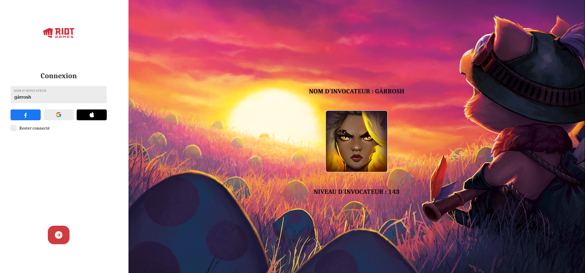

# League-Of-Legends-Search-Player

Hello there,

Here is the **League-Of-Legends-Search-Player**. 

This project was realised with ```Create React App```.

With **Riot Games API** I can **get** and **display** the **name**, **profile picture** and **level** of the **summoner**.
(see the screen below).

Use of the Riot **Games API**. ```https://developer.riotgames.com/```

The design of this page is realized with :

* HTML
* CSS
* JavaScript
* ReactJs

## Front End

The style of the page reminds us a bit of a **League of Legends** style **login page**, so I tried to respect the **graphic charter** as much as possible.

In the near future I will try to get the **victories** and **defeats** as well as the **victory rate** of the summoner and display them in addition.

## Requirements

* npx create-react-app (your app)
* cd (your app)
* npm start
    Runs the app in the development mode.
    Open http://localhost:3000 to view it in the browser.

    The page will reload if you make edits.
    You will also see any lint errors in the console.
* npm install axios

## Below a screenshot allowing to realize the design .


