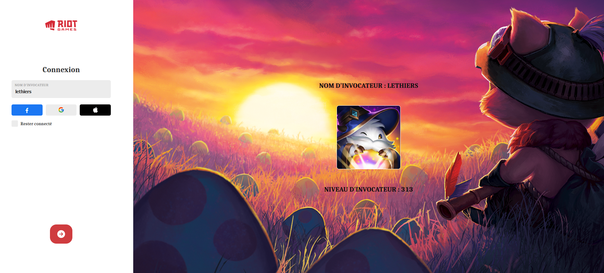

# League-Of-Legends-Search-Player

Hello there,

Here is the **League-Of-Legends-Search-Player**. 

With Riot Games api I can get and display the name, profile picture and level of the summoner.
(see the screen below).

Use of the Riot **Games API**. ```https://developer.riotgames.com/```

The design of this page is realized with :

* HTML
* CSS
* JavaScript
* ReactJs

## Requirements

* npx create-react-app (your app)
* cd (your app)
* npm start
    Runs the app in the development mode.
    Open http://localhost:3000 to view it in the browser.

    The page will reload if you make edits.
    You will also see any lint errors in the console.
* npm install axios

## Below a screenshot allowing to realize the design .


